# Architecture — AI Assistant For Excel

End-to-end flow from the moment a user sends a message to the final Excel
mutation. Every box in the diagrams maps to a real file in the repo.

The system has **two execution frontends** sharing the same planner:

- **Office.js add-in** (taskpane) — runs inside Excel, universal (Windows /
  Mac / Web / iPad), single-workbook scope.
- **MCP server** (`backend/mcp_server.py`) — stdio transport, exposes the
  same 94-action catalog to any MCP client (Claude Desktop, Cursor, Zed,
  Windsurf), executes against the desktop Excel via `xlwings`, supports
  cross-workbook operations the add-in can't do.

Every `StepAction` exists in three mirrored layers: TypeScript handler →
Pydantic params + LLM-side description → Python xlwings handler. Full
parity is verified automatically by the test suites.

---

## High-Level Overview

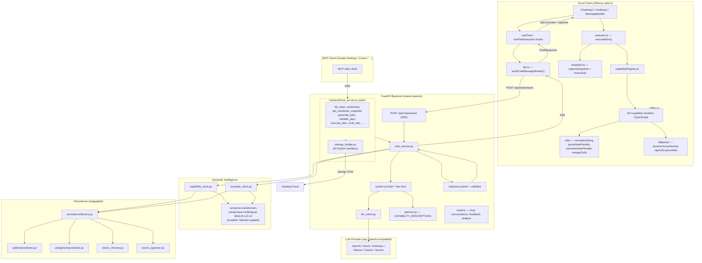

---

## Detailed Request Flow (add-in mode)

```mermaid
sequenceDiagram
    participant U as User
    participant CP as ChatPanel
    participant UC as useChat Hook
    participant API as api.ts
    participant R as /api/chat/stream
    participant CS as chat_service
    participant Cap as capability_store
    participant Ex as example_store
    participant DB as Vector Store<br/>(Chroma / pgvector)
    participant LLM as LLM Provider
    participant PR as _parse_response
    participant Repo as Repositories<br/>(SQLite / Postgres)
    participant EX as executor.ts
    participant OH as Office.js Handlers
    participant XL as Excel Workbook
    participant FB as /api/feedback

    U->>CP: Types message + optional range selection
    CP->>UC: handleSend(text, rangeTokens)

    Note over UC: Builds ChatRequest:<br/>userMessage, rangeTokens,<br/>workbookSnapshot (headers,<br/>dtypes, 10 sample rows,<br/>anchorCell, usedRangeAddress),<br/>conversationHistory, activeSheet, locale

    UC->>API: sendChatMessageStream(request)
    API->>R: POST /api/chat/stream (SSE)

    R->>CS: chat_stream(ChatRequest)

    rect rgb(230, 245, 255)
        Note over CS,DB: Phase 1 — Semantic Search
        CS->>Cap: search_capabilities(userMessage)
        Cap->>DB: query "capabilities" collection
        DB-->>Cap: top-K action names
        Cap-->>CS: relevant_actions[]
    end

    rect rgb(255, 245, 230)
        Note over CS,Ex: Phase 2 — Build Prompt
        CS->>CS: _build_chat_system_prompt(relevant_actions)
        Note over CS: LANGUAGE RULE at top (line 1);<br/>filter CAPABILITY_DESCRIPTIONS to<br/>only relevant actions; 600+ line<br/>system prompt with schema,<br/>rules, dashboard patterns,<br/>OUT-OF-SCOPE section, Hebrew<br/>directional hints, self-join<br/>formula guidance.

        CS->>Ex: search_examples(userMessage, top_k=5)
        Ex->>DB: query "few_shot_examples" (v4 seeds)
        DB-->>Ex: similar examples
        Ex-->>CS: few-shot message pairs

        CS->>CS: _build_user_content(request)
        Note over CS: Injects: date/time, locale-aware<br/>date format, range tokens,<br/>used range end, workbook<br/>snapshot with ⚠ WARNING
    end

    rect rgb(230, 255, 230)
        Note over CS,LLM: Phase 3 — LLM Streaming
        CS->>LLM: acompletion_stream(messages)
        loop Token by token
            LLM-->>CS: delta text
            CS-->>R: SSE event: {type: "chunk", text}
            R-->>API: chunk
            API-->>UC: onChunk → streaming preview
        end
    end

    rect rgb(255, 230, 245)
        Note over CS,PR: Phase 4 — Parse, Validate, Localize
        CS->>PR: _parse_response(full_text)
        Note over PR: 1. extract_json()<br/>2. Extract messageLocalized +<br/>   optionLabelLocalized from parsed<br/>3. Salvage off-schema outputs<br/>   (bare step, tool_calls, aliases)<br/>4. _fill_plan_defaults()<br/>5. Pydantic validate steps +<br/>   bindings + cycle check

        alt Parse succeeds
            PR-->>CS: ChatResponse
        else Parse fails — Retry
            CS->>LLM: Compact retry prompt (20 lines)
            LLM-->>CS: second attempt
            CS-->>R: SSE event: {type: "reset"}
            CS->>PR: _parse_response(retry_text)
            PR-->>CS: ChatResponse
        else Both fail
            CS-->>R: Friendly error message
        end
    end

    CS->>Repo: _persist_conversation_turn()
    Note over Repo: Save user msg + assistant response<br/>+ plan. Persist messageLocalized<br/>when set (reload preserves Hebrew).

    CS-->>R: SSE event: {type: "done", result}
    R-->>API: final SSE
    API-->>UC: ChatResponse

    alt responseType = "message"
        UC->>CP: Display text (messageLocalized ?? message)
    else responseType = "plans"
        UC->>CP: Show plan option cards (2-3)
        U->>CP: Selects preferred plan
    end

    rect rgb(245, 245, 220)
        Note over U,XL: Phase 5 — Plan Execution
        U->>CP: Clicks "Run" on chosen plan
        CP->>EX: executePlan(plan, callbacks)

        EX->>EX: validator.validate(plan)
        EX->>EX: topologicalSort(steps)

        loop For each step (dependency order)
            EX->>EX: captureSnapshot(affected ranges)
            Note over EX: Empty snapshot for structural<br/>ops — handler attaches InverseOp
            EX->>OH: handler(context, params)
            Note over OH: Handler runs:<br/>- normalizeString / parseNumberFlexible /<br/>  parseDateFlexible for dirty data<br/>- ensureUnmerged (5 wired handlers)<br/>- clipFullColumnRefs (writeFormula,<br/>  spillFormula)<br/>- dynamicArrayRewrite on pre-365 Excel<br/>- registerInverseOp for structural ops<br/>- expandSnapshotFootprint for wide writes
            OH->>XL: Office.js API calls
            XL-->>OH: result
            OH-->>EX: StepResult
            EX-->>CP: onStepComplete callback
        end

        alt Step fails
            EX->>EX: rollbackPlan() — restore cell values +<br/>apply inverse ops in reverse order
        end

        EX-->>CP: ExecutionState
    end

    CP->>FB: sendFeedback(interactionId, planId, "applied")
    FB->>Repo: Log feedback
    FB->>Ex: add_user_example() — promote to few-shot pool
    Ex->>DB: Upsert into "few_shot_examples"
```

---

## Detailed Request Flow (MCP mode)

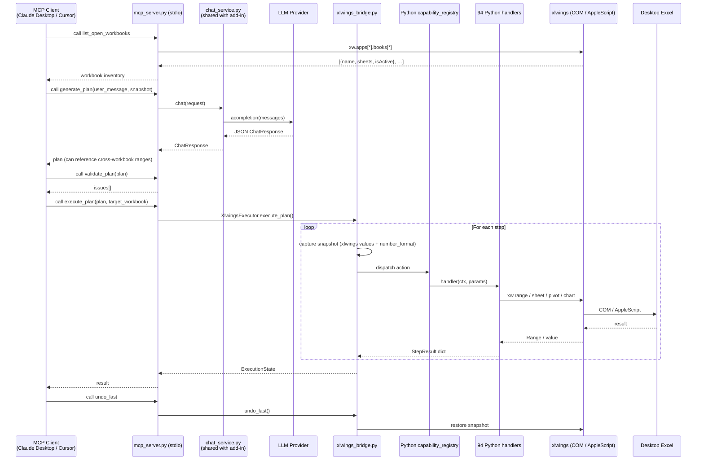

---

## Component Map

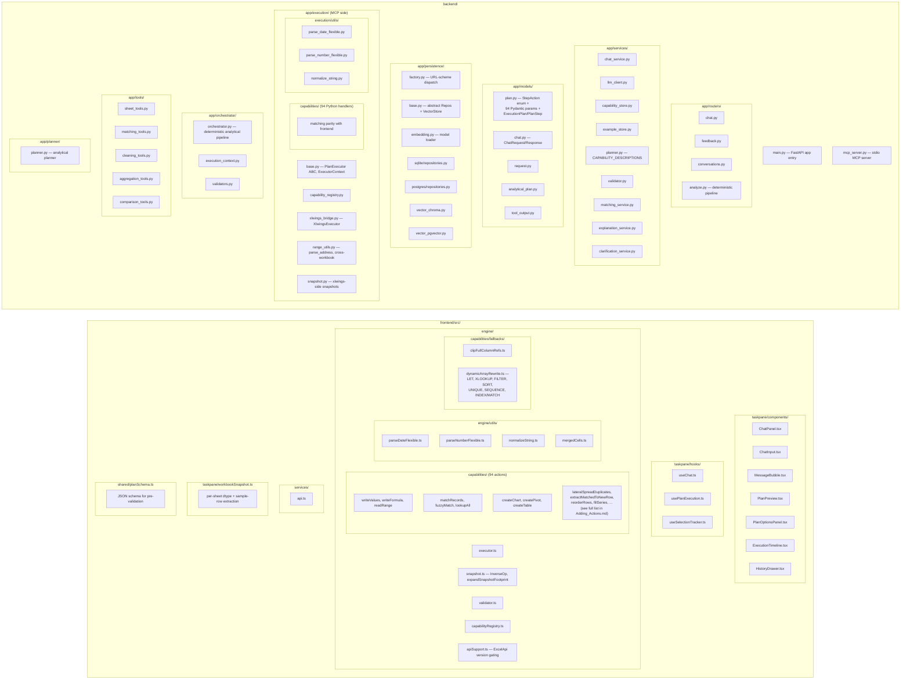

---

## Data Models

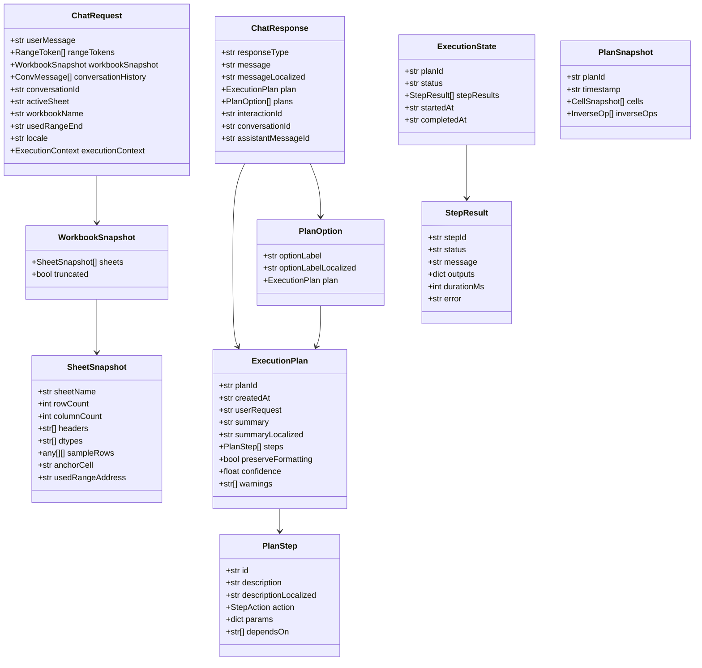

**Canonical-English + `*Localized` pattern.** `message`, `summary`,
`description`, `optionLabel` are always English for stable logs and LLM
planning; the paired `messageLocalized`, `summaryLocalized`,
`descriptionLocalized`, `optionLabelLocalized` carry faithful translations
when the user writes in a non-English language. UIs prefer the localized
field when present.

---

## Persistence Layer (swappable)

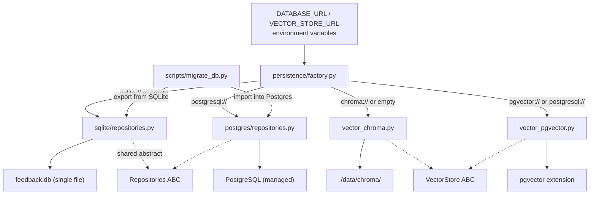

**Development:** `DATABASE_URL=""` (SQLite) + `VECTOR_STORE_URL=""`
(ChromaDB). Everything lives in `backend/data/`.

**Production:** `DATABASE_URL="postgresql://…"` +
`VECTOR_STORE_URL="pgvector://…"` (often the same instance). Migrate with
`backend/scripts/migrate_db.py`.

---

## Semantic Search Pipeline

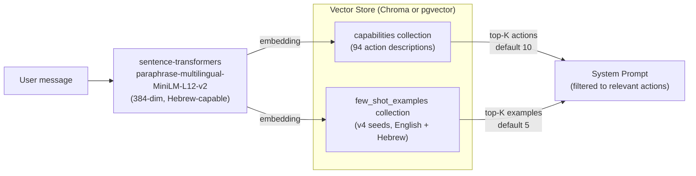

**Seed versioning.** `example_store.SEED_VERSION` bumps on every
prompt-format migration. Init routine purges prior-version seeds from the
vector store before re-seeding the current version, so retrieval never
returns stale patterns. Currently on **v4**.

---

## Execution Engine (frontend, Office.js)

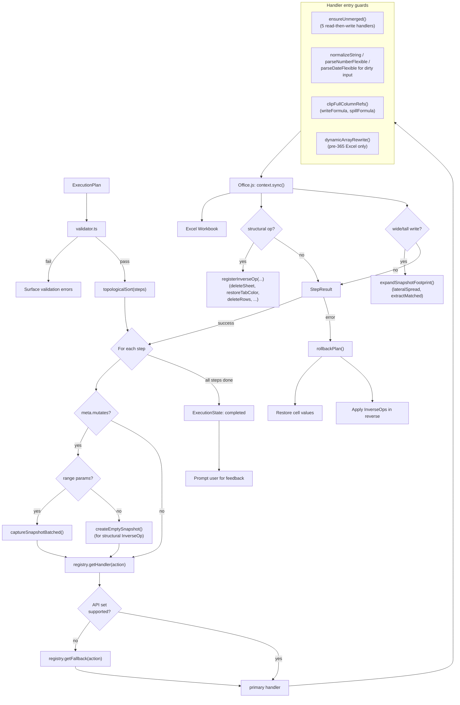

---

## Excel 2016 Compatibility Layer

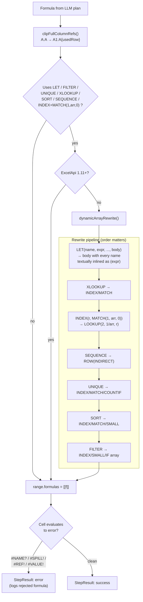

**17 handlers register legacy fallbacks** for the Office.js API methods
they use (createPivot → SUMIFS summary, addSparkline → mini charts,
addSlicer → applyFilter guidance, etc.). Dispatch happens at
`capabilityRegistry.getFallback(action)` when `meta.requiresApiSet` is
greater than the current Excel's support level.

---

## Feedback Loop & Continuous Learning

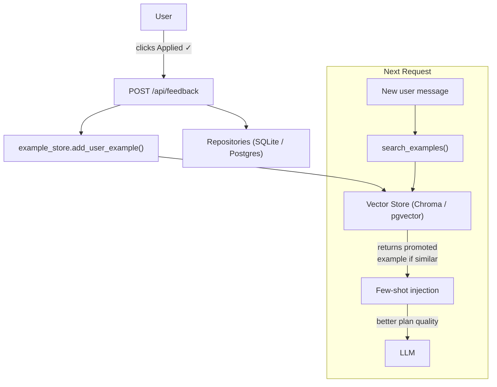

---

## Deployment Topology

### Add-in mode (OpenShift)

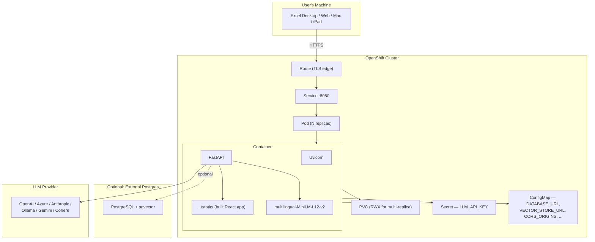

### MCP mode (desktop)

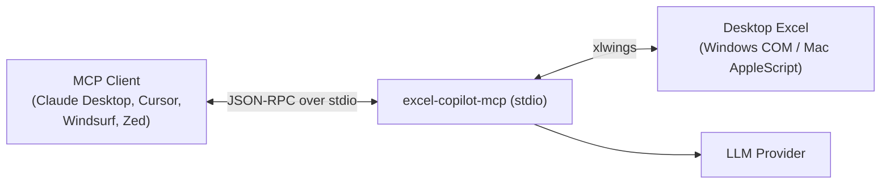

Installed as a console script via `backend/pyproject.toml`. MCP client
config is a one-line entry: `{"excel-copilot": {"command":
"excel-copilot-mcp"}}`.

---

## Capability-layer invariants (enforced by tests)

| Invariant | Test |
|---|---|
| Every TS `StepAction` has a Pydantic param model | `test_chat_service.py::test_all_actions_have_param_models` |
| Every Pydantic param has a Python xlwings handler | runtime registry scan at startup |
| Every TS handler file is imported in `capabilities/index.ts` | `capability-compliance.test.ts` |
| Handlers that load `.values` use `getUsedRange(false)` (or are exempt) | `capability-compliance.test.ts` |
| Handlers with `requiresApiSet > 1.3` register a fallback | `capabilityRegistry.fallback.test.ts` |
| Every handler uses `options.dryRun` guard | `capability-compliance.test.ts` |
| Handlers with sync-after-writes have try-catch | `capability-compliance.test.ts` |

**Action count verification at test time:** 94 TS handlers = 94 Pydantic
param models = 94 Python xlwings handlers. If someone adds an action to
one side without mirroring, the test suite fails.

---

## Security / Air-gap posture

- Telemetry disabled: `ANONYMIZED_TELEMETRY=False`, `HF_HUB_OFFLINE=1`,
  `TRANSFORMERS_OFFLINE=1` (baked into `Dockerfile` and
  `openshift/configmap.yaml`).
- Embedding model bundled on disk — no HuggingFace calls at runtime.
- LLM endpoint fully configurable — works with on-prem Ollama / internal
  OpenAI-compatible gateways.
- Model weights excluded from git (`*.safetensors` etc. in `.gitignore`);
  `backend/scripts/download_embedding_model.py` fetches on first
  container build.
- See `docs/AIRGAP.md` for the enclosed-network checklist and
  `docs/SECURITY_CHECKLIST.md` for production hardening steps.
