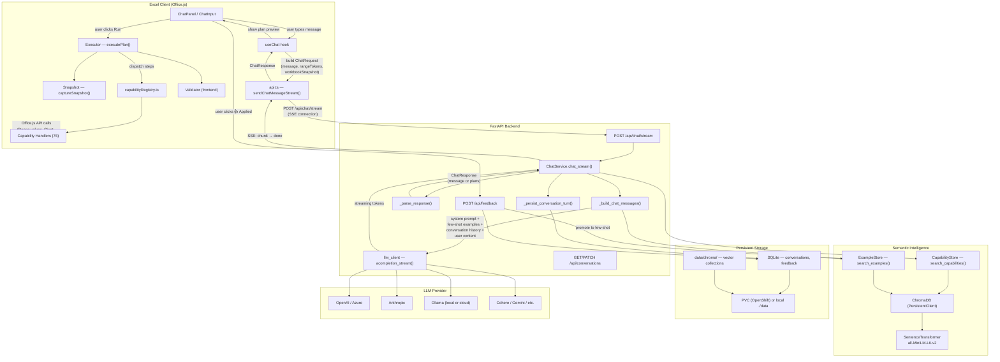
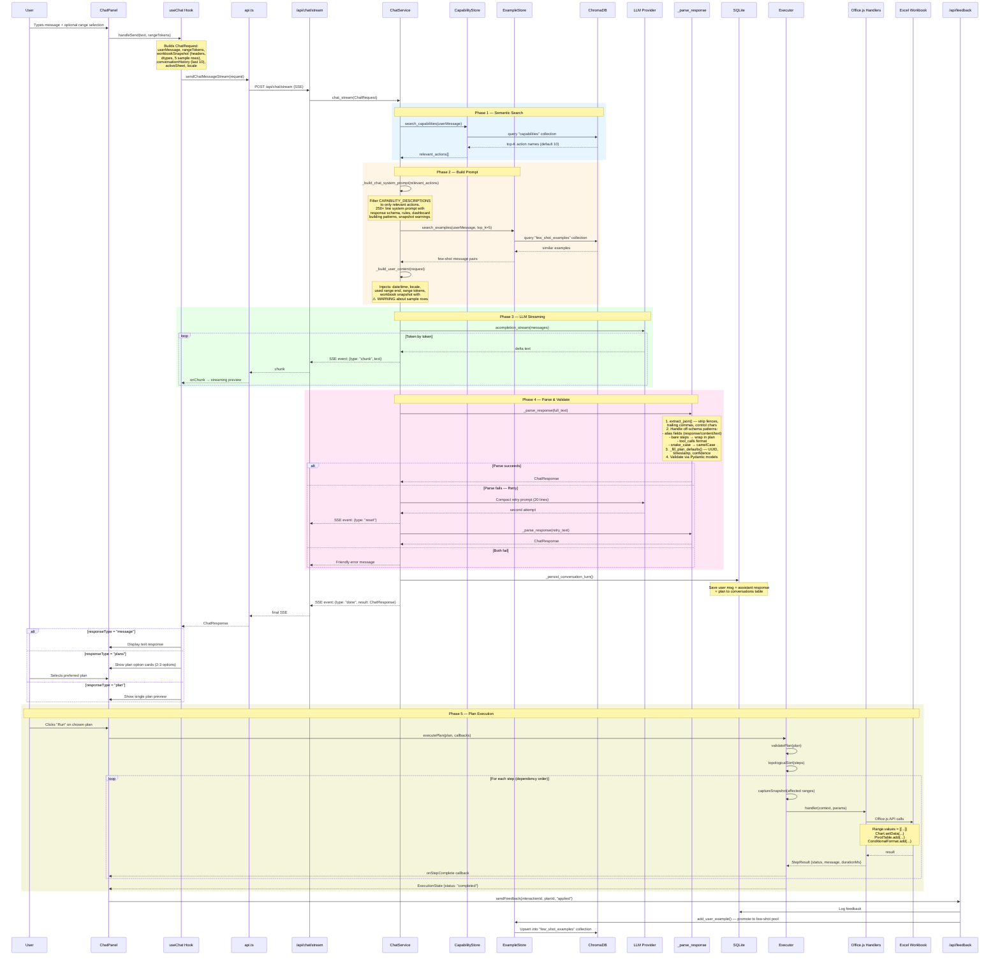
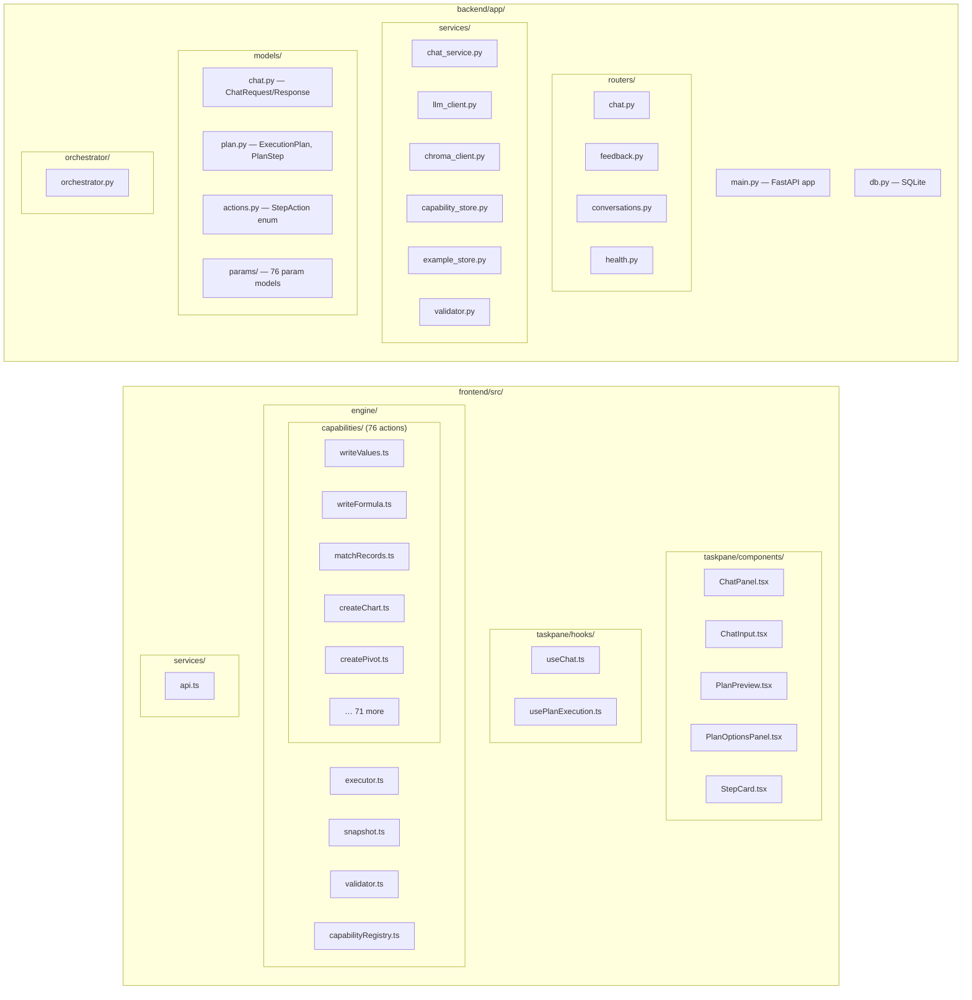
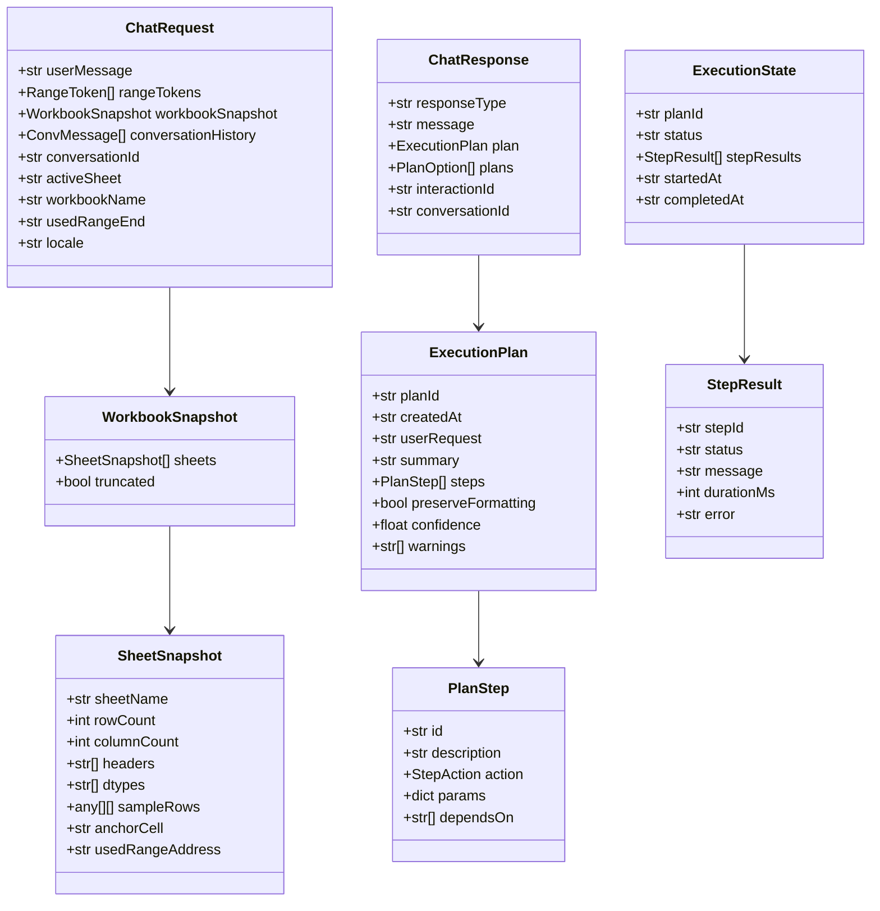
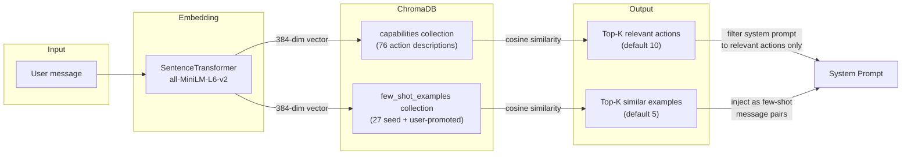
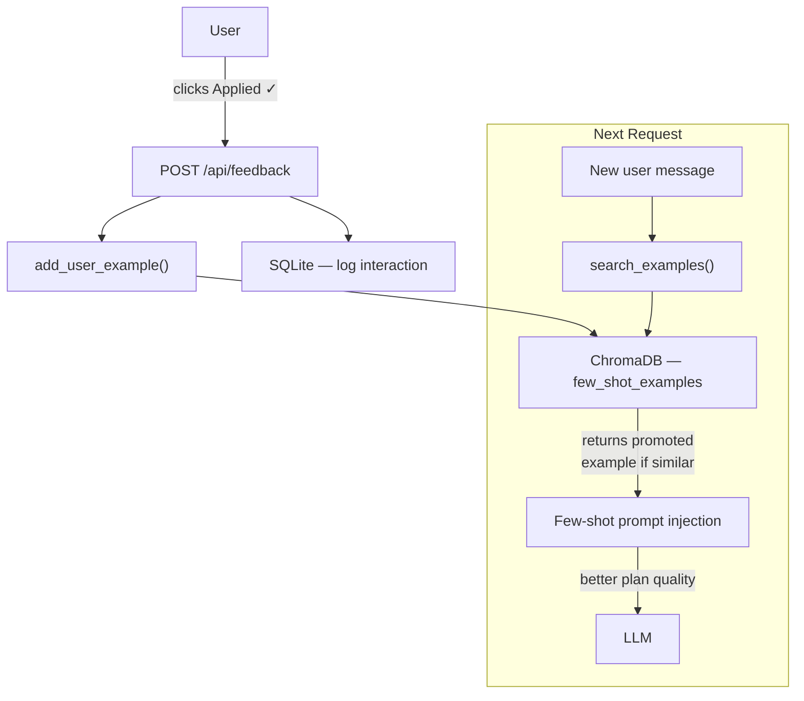
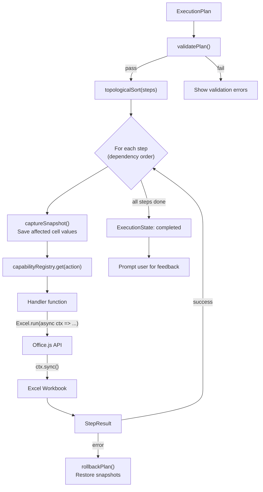

# Architecture — AI Assistant For Excel

End-to-end flow from the moment a user sends a message to the final
Excel mutation. Every box in the diagrams maps to a real file in the repo.

---

## High-Level Overview



---

## Detailed Request Flow



---

## Component Map



---

## Data Models



---

## Semantic Search Pipeline



---

## Feedback Loop & Continuous Learning



---

## Execution Engine (Frontend)



---

## Deployment Topology (OpenShift)

```mermaid
flowchart TB
    subgraph UserMachine["User's Machine"]
        ExcelApp["Excel Desktop / Web"]
    end

    subgraph OpenShift["OpenShift Cluster"]
        Route["Route (TLS edge)\nhttps://excel-assistant.apps..."]
        Service["Service :8080"]
        Pod["Pod (1 replica)"]

        subgraph Container["Container"]
            Uvicorn["Uvicorn (1 worker)"]
            FastAPI["FastAPI App"]
            Static["./static/ (built React app)"]
            Model["all-MiniLM-L6-v2\n(bundled ~87MB)"]
        end

        PVC["PVC 2Gi (RWO)"]
        Secret["Secret\nexcel-assistant-secrets"]
        ConfigMap["ConfigMap\nexcel-assistant-config"]
    end

    subgraph External["External (or internal)"]
        LLMApi["LLM API\n(OpenAI / Anthropic / Ollama)"]
    end

    ExcelApp -->|"HTTPS"| Route
    Route -->|"HTTP :8080"| Service
    Service --> Pod
    Pod --> Container
    Uvicorn --> FastAPI
    FastAPI -->|"serves"| Static
    FastAPI -->|"uses"| Model
    Container -->|"mount"| PVC
    Container -->|"env from"| Secret
    Container -->|"env from"| ConfigMap
    FastAPI -->|"API calls"| LLMApi
